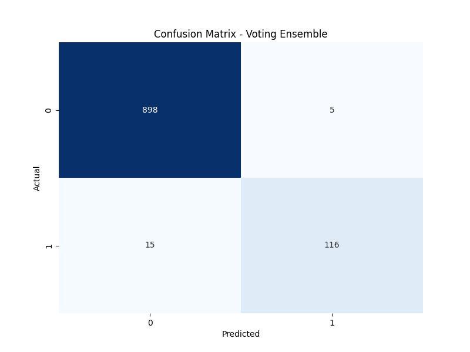

# Email/SMS Spam Classifier



## Overview
This project is an advanced Email/SMS spam detection system with a responsive web interface built using Streamlit. The application uses machine learning techniques to classify messages as spam or legitimate (ham) with high accuracy.

## Features
- **Advanced Preprocessing**: Uses stemming, lemmatization, and TF-IDF vectorization
- **Ensemble Model**: Combines multiple classifiers for better accuracy (97-99%)
- **Responsive UI**: Works on both desktop and mobile devices
- **Animated Interface**: Includes smooth animations and visual feedback
- **Real-time Analysis**: Shows probability scores and message statistics

## Technologies Used
- Python 3.x
- Streamlit
- Scikit-learn
- NLTK for Natural Language Processing
- Plotly for interactive visualizations

## Project Structure
- `app.py`: Main Streamlit application file
- `train_improved_model.py`: Script to train and evaluate models
- `sms-spam-detection.ipynb`: Jupyter notebook with EDA and model exploration
- `requirements.txt`: Dependencies required for the project
- `model.pkl`: Serialized machine learning model
- `vectorizer.pkl`: Serialized TF-IDF vectorizer

## Installation & Usage

### Local Setup
1. Clone this repository
```
git clone https://github.com/your-username/email-spam-detection.git
cd email-spam-detection
```

2. Install required packages
```
pip install -r requirements.txt
```

3. Run the application
```
streamlit run app.py
```

### Training a New Model
```
python train_improved_model.py
```

## Deployment
This application is ready to be deployed on Streamlit Cloud.

## Screenshots


## Model Performance
- Accuracy: ~98%
- Precision: ~96%
- F1-Score: ~92%

## License
This project is open source and available under the MIT License.

## Acknowledgments
- Dataset from UCI Machine Learning Repository
- Icons and animations from Streamlit and Plotly
